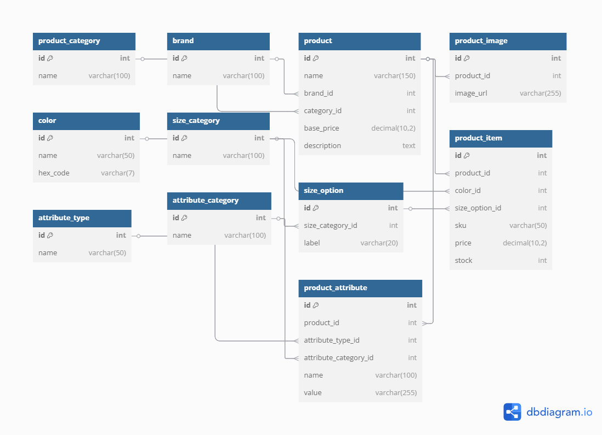

# 🛒 E-Commerce Database Design

Welcome to our Peer Group Assignment repository for **E-commerce Database Design**. This project aims to demonstrate effective database design using an Entity-Relationship Diagram (ERD) and a normalized SQL schema to support a flexible and scalable e-commerce platform.

---

## 📌 Objective

To collaboratively design and implement a relational database schema that supports a real-world e-commerce application including:

- Products and Variations
- Brands and Categories
- Images, Colors, and Sizes
- Product Attributes and Types

---

## 📐 Entity-Relationship Diagram (ERD)

We used [dbdiagram.io](https://dbdiagram.io) to design our ERD. It outlines the relationships between all entities required in an e-commerce platform.



> 🔗 ERD link: [View on dbdiagram.io](https://dbdiagram.io/d/ecommerce-erd-680bb3591ca52373f562a53c)

---

## 🗃️ Database Schema Overview

### ✅ Tables Created

| Table Name           | Description |
|----------------------|-------------|
| `product_category`   | Classifies products into categories (e.g., clothing, electronics) |
| `brand`              | Stores brand-related data |
| `product`            | General product info including brand and category |
| `product_image`      | Product image URLs from Unsplash |
| `color`              | Available color options |
| `size_category`      | Groups of sizes (e.g., clothing sizes) |
| `size_option`        | Specific sizes under each size category |
| `product_item`       | Purchasable items with variation (color, size) |
| `attribute_type`     | Types of attributes (text, number, boolean) |
| `attribute_category` | Groups of attributes (e.g., physical, technical) |
| `product_attribute`  | Custom product attributes |

---

## 🗂️ Sample Data Inserted

We included sample data for:

- Brands (Nike, Samsung)
- Categories (Clothing, Electronics)
- Products (Air Max Sneakers, Galaxy S21)
- Colors (Red, Blue)
- Sizes (S, M, L)
- Product Items with SKUs
- Real Unsplash images
- Attribute types and categories

```sql
-- Sample product_image insert
INSERT INTO product_image (product_id, image_url) VALUES
(1, 'https://unsplash.com/photos/white-nike-air-max-sneakers-lo4Xf1ezaQA'),
(2, 'https://unsplash.com/photos/a-cell-phone-is-flying-through-the-air-m82jt07HZEg');
